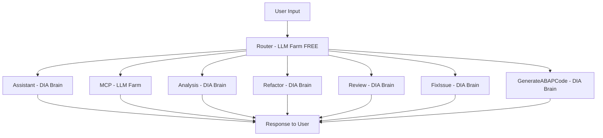

# Octo Project - Architecture Documentation

## Overview

- **Project**: pi-boi-main (codename: Octo)
- **Identity**: AI Agent specialized in SAP ABAP S4Hana, SAP ABAP on cloud, and ABAP refactoring (from ABAP R3 ECC to ABAP S4Hana syntax 7.5+)
- **Platform**: SAP BTP

---

## AI Models

| Model                                 | Cost | Use Case                                                           |
| ------------------------------------- | ---- | ------------------------------------------------------------------ |
| **LLM Farm** (gpt-5-nano)             | FREE | Router, MCP                                                        |
| **DIA Brain** (Claude Opus 4.6 + RAG) | PAID | Assistant, Analysis, Refactor, Review, FixIssue, GenerateABAPCode |

### Token Optimization (DIA Brain)

- Send only required context (transform & trim)
- Load only relevant skills

---

## Skills

| Skill                | Model     | Description                                                     |
| -------------------- | --------- | --------------------------------------------------------------- |
| **Assistant**        | DIA Brain | AI assistant for all SAP ABAP related questions                |
| **MCP**              | LLM Farm  | Connect to SAP on-prem systems from BTP through MCP server     |
| **Analysis**         | DIA Brain | Analyze SAP ABAP objects                                       |
| **Refactor**         | DIA Brain | Refactor R3 -> S4 ABAP (syntax 7.5, CleanCode)                |
| **Review**           | DIA Brain | Review ABAP code and propose improvements                      |
| **FixIssue**         | DIA Brain | Fix ABAP bugs based on issue logs from ATC checks             |
| **GenerateABAPCode** | DIA Brain | Generate ABAP code automatically from natural language         |

### Skill Definition

- Each skill is defined in a dedicated `SKILL.md` file with instructions
- Path: `core-service/skills/<skill-name>/SKILL.md`

### Tools

- `mcp.ts`, `assistant.ts`, `analysis.ts`, `refactor.ts`, `review.ts`, `fixIssue.ts`, `generaterABAPCode.ts`
- Each `*.ts` tool is TypeScript code that executes the corresponding skill
- Path: `core-service/src/tools/<tool-name>.ts`

---

## Architecture Flow



### Router Output Mapping (Easy Read)

| Router Selected Skill | Tool/Module          | Primary Outcome                      |
| --------------------- | -------------------- | ------------------------------------ |
| Assistant             | assistant.ts         | Answer ABAP-related questions        |
| MCP                   | mcp.ts               | Call SAP on-prem through MCP         |
| Analysis              | analysis.ts          | Analyze ABAP objects                 |
| Refactor              | refactor.ts          | Refactor R3 -> S4 (7.5+)             |
| Review                | review.ts            | Review code and suggest improvements |
| FixIssue              | fixIssue.ts          | Fix issues based on ATC logs         |
| GenerateABAPCode      | generaterABAPCode.ts | Generate ABAP code from prompts      |

## Implementation Tasks

| #   | Task                                    | Priority | Status |
| --- | --------------------------------------- | -------- | ------ |
| 1   | Router module (classify, select skills) | High     | Open   |
| 2   | AI Assistant                            | High     | Open   |
| 3   | MCP                                     | High     | Open   |
| 4   | Analysis                                | High     | Open   |
| 5   | Refactor                                | High     | Open   |
| 6   | Review                                  | High     | Open   |
| 7   | FixIssue                                | High     | Open   |
| 8   | GenerateABAPCode                        | High     | Open   |

---

## Technical Decisions

| Decision        | Choice                             | Reason                         |
| --------------- | ---------------------------------- | ------------------------------ |
| Router logic    | LLM prompt + few-shot              | Flexible and easy to update    |
| Fallback model  | DIA Brain                          | Safer for unknown requests     |
| Hybrid requests | Sequential (parallel only for MCP) | Avoid race conditions          |
| Context sharing | Transform format between models    | Different model APIs           |
| Error handling  | Report to user                     | User decides the next step     |

---

## Configuration

### Environment Variables

```
# LLM Farm
LLM_FARM_PROVIDER=...
LLM_FARM_MODEL=gpt-5-nano
LLM_FARM_BASE_URL=...
LLM_FARM_API_KEY=...

# DIA Brain
DIA_BRAIN_PROVIDER=...
DIA_BRAIN_MODEL=gemini-2.5-pro
DIA_BRAIN_BASE_URL=...
DIA_BRAIN_API_KEY=...
```

---

## File Structure

```text
pi-boi-main/
├─ Cursor.md         # Main architecture document for the project
├─ .gitignore        # Files/directories excluded from git commits
├─ core-service/     # Backend + agent runtime + skill execution
└─ web-ui/           # User interface (frontend)
```

### core-service (Backend / Agent Runtime)

```text
core-service/
├─ src/                  # Main backend source code
│  ├─ main.ts            # Service startup entry point
│  ├─ agent.ts           # Main agent orchestration logic
│  ├─ http.ts            # HTTP server / API endpoints
│  ├─ context.ts         # Request/session context management
│  ├─ events.ts          # Internal event bus / event flow
│  ├─ slack.ts           # Slack integration (if enabled)
│  ├─ sandbox.ts         # Safe task execution sandbox
│  ├─ store.ts           # Runtime state/data storage
│  └─ tools/             # Agent tool implementations
├─ skills/               # Skill definitions (SKILL.md + related assets)
├─ docs/                 # Backend technical documentation
├─ scripts/              # Utility/build/migration scripts
├─ package.json          # Backend dependencies and npm scripts
├─ tsconfig.build.json   # TypeScript config for build
├─ .env.example          # Environment variable template
└─ README.md             # Backend setup and development guide
```

### web-ui (Frontend)

```text
web-ui/
├─ src/                  # Main frontend source code
│  ├─ components/        # Reusable UI components
│  ├─ dialogs/           # Modal/dialog UI modules
│  ├─ tools/             # UI tool renderers + artifacts
│  ├─ storage/           # Client-side state/storage layer
│  ├─ adapters/          # Adapters to backend/services
│  ├─ prompts/           # Prompt templates for UI workflows
│  ├─ utils/             # Shared utility helpers
│  ├─ ChatPanel.ts       # Main chat panel screen
│  └─ index.ts           # UI export/bootstrap entry point
├─ example/              # Demo/integration sample app
├─ scripts/              # Frontend build/dev scripts
├─ package.json          # Frontend dependencies and npm scripts
├─ tsconfig.json         # Main TypeScript config
├─ tsconfig.build.json   # TypeScript config for build output
├─ CHANGELOG.md          # Version change history
└─ README.md             # Frontend usage guide
```
