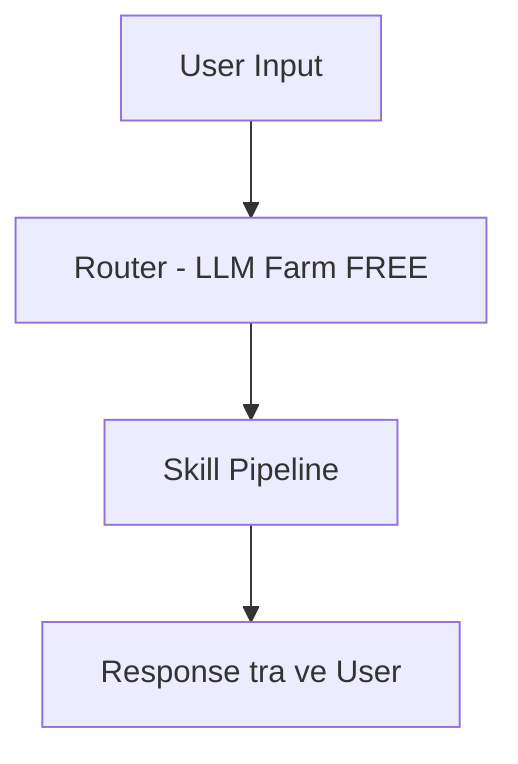

# Octo Project - Tài liệu Kiến trúc

## Tổng quan

- **Dự án**: pi-boi-main (tên gọi: Octo)
- **Định vị**: AI Agent chuyên về SAP ABAP S4Hana, SAP ABAP on cloud, refactor ABAP (từ ABAP R3 ECC sang cú pháp ABAP S4Hana mới 7.5+)
- **Nền tảng**: SAP BTP

---

## Mô hình AI

| Model                                 | Chi phí | Mục đích sử dụng                                                   |
| ------------------------------------- | ------- | ------------------------------------------------------------------ |
| **LLM Farm** (gpt-5-nano)             | FREE    | Router, MCP                                                        |
| **DIA Brain** (Claude Opus 4.6 + RAG) | PAID    | Assistant, Analysis, Refactor, Review, FixIssue, GenerateABAPCode |

### Tối ưu Token (DIA Brain)

- Chỉ gửi context cần thiết (transform & trim)
- Chỉ load skill liên quan

---

## Skills

| Skill                | Model     | Mô tả                                                          |
| -------------------- | --------- | -------------------------------------------------------------- |
| **Assistant**        | DIA Brain | AI Assistant giải đáp tất cả câu hỏi liên quan SAP ABAP       |
| **MCP**              | LLM Farm  | Gọi hệ thống SAP on-prem từ BTP qua MCP server                |
| **Analysis**         | DIA Brain | Phân tích SAP ABAP objects                                     |
| **Refactor**         | DIA Brain | Refactor R3 -> S4 ABAP (syntax 7.5, CleanCode)                |
| **Review**           | DIA Brain | Review ABAP code, đề xuất cải tiến                             |
| **FixIssue**         | DIA Brain | Fix ABAP bugs dựa vào issue logs từ ATC check                  |
| **GenerateABAPCode** | DIA Brain | Tạo ABAP code tự động từ ngôn ngữ tự nhiên                     |

### Định nghĩa Skill

- Mỗi skill là một file `SKILL.md` riêng với instructions
- Đường dẫn: `core-service/skills/<skill-name>/SKILL.md`

### Tools

- `mcp.ts`, `assistant.ts`, `analysis.ts`, `refactor.ts`, `review.ts`, `fixIssue.ts`, `generaterABAPCode.ts`
- Mỗi tool `*.ts` là mã TypeScript dùng để thực thi skill tương ứng
- Đường dẫn: `core-service/src/tools/<tool-name>.ts`

---

## Luồng Kiến trúc



- Skill Pipeline = chuoi skills co the goi lien tiep nhau.
- Skills hien co trong pipeline: `Assistant`, `MCP`, `Analysis`, `Refactor`, `Review`, `FixIssue`, `GenerateABAPCode`.
- Skill mac dinh: neu Router khong match ro intent thi chuyen ve `Assistant`.
- Output cua skill truoc la input cua skill sau.
- Vi du chain: `MCP -> Analysis -> Refactor -> Review -> Response`.

### Mapping đầu ra Router (Dễ đọc)

| Router chọn skill | Tool/Module          | Kết quả chính                   |
| ----------------- | -------------------- | ------------------------------- |
| Assistant         | assistant.ts         | Trả lời câu hỏi ABAP            |
| MCP               | mcp.ts               | Gọi SAP on-prem qua MCP         |
| Analysis          | analysis.ts          | Phân tích ABAP object           |
| Refactor          | refactor.ts          | Refactor R3 -> S4 (7.5+)        |
| Review            | review.ts            | Review code và đề xuất cải tiến |
| FixIssue          | fixIssue.ts          | Sửa lỗi theo ATC logs           |
| GenerateABAPCode  | generaterABAPCode.ts | Sinh ABAP code từ prompt        |

## Nhiệm vụ Triển khai

| #   | Task                                    | Ưu tiên | Trạng thái |
| --- | --------------------------------------- | ------- | ---------- |
| 1   | Router module (classify, select skills) | Cao     | Open       |
| 2   | AI Assistant                            | Cao     | Open       |
| 3   | MCP                                     | Cao     | Open       |
| 4   | Analysis                                | Cao     | Open       |
| 5   | Refactor                                | Cao     | Open       |
| 6   | Review                                  | Cao     | Open       |
| 7   | FixIssue                                | Cao     | Open       |
| 8   | GenerateABAPCode                        | Cao     | Open       |

---

## Quyết định Kỹ thuật

| Quyết định      | Lựa chọn                           | Lý do                      |
| --------------- | ---------------------------------- | -------------------------- |
| Router logic    | LLM prompt + few-shot              | Linh hoạt, dễ cập nhật     |
| Fallback model  | DIA Brain                          | An toàn hơn cho yêu cầu lạ |
| Hybrid requests | Sequential (parallel cho MCP)      | Tránh race condition       |
| Context sharing | Transform format giữa các model    | API khác nhau              |
| Error handling  | Report cho user                    | User quyết định bước tiếp  |

---

## Cấu hình

### Biến môi trường

```
# LLM Farm
LLM_FARM_PROVIDER=...
LLM_FARM_MODEL=gpt-5-nano
LLM_FARM_BASE_URL=...
LLM_FARM_API_KEY=...

# DIA Brain
DIA_BRAIN_PROVIDER=...
DIA_BRAIN_MODEL=gemini-2.5-pro
DIA_BRAIN_BASE_URL=...
DIA_BRAIN_API_KEY=...
```

---

## Cấu trúc File

```text
pi-boi-main/
├─ Cursor.md         # Tài liệu kiến trúc tổng quan của dự án
├─ .gitignore        # Danh sách file/thư mục bỏ qua khi commit
├─ core-service/     # Backend + agent runtime + skill execution
└─ web-ui/           # Giao diện người dùng (frontend)
```

### core-service (Backend / Agent Runtime)

```text
core-service/
├─ src/                  # Source code chính của backend
│  ├─ main.ts            # Entry point khởi chạy service
│  ├─ agent.ts           # Logic điều phối agent chính
│  ├─ http.ts            # HTTP server / API endpoints
│  ├─ context.ts         # Quản lý context cho request/session
│  ├─ events.ts          # Event bus / luồng sự kiện nội bộ
│  ├─ slack.ts           # Tích hợp Slack (nếu bật)
│  ├─ sandbox.ts         # Cơ chế chạy tác vụ an toàn (sandbox)
│  ├─ store.ts           # Lưu trữ state / dữ liệu runtime
│  └─ tools/             # Tool implementations cho agent
├─ skills/               # Định nghĩa skills (SKILL.md + assets liên quan)
├─ docs/                 # Tài liệu kỹ thuật backend
├─ scripts/              # Scripts tiện ích/build/migrate
├─ package.json          # Dependencies và npm scripts backend
├─ tsconfig.build.json   # Cấu hình TypeScript cho build
├─ .env.example          # Mẫu biến môi trường
└─ README.md             # Hướng dẫn chạy và phát triển backend
```

### web-ui (Frontend)

```text
web-ui/
├─ src/                  # Source code chính của frontend
│  ├─ components/        # UI components tái sử dụng
│  ├─ dialogs/           # Các modal/dialog giao diện
│  ├─ tools/             # UI tool renderers + artifacts
│  ├─ storage/           # State/storage layer phía client
│  ├─ adapters/          # Adapter kết nối với backend/services
│  ├─ prompts/           # Prompt templates cho UI workflows
│  ├─ utils/             # Hàm tiện ích dùng chung
│  ├─ ChatPanel.ts       # Màn hình chat/panel chính
│  └─ index.ts           # Entry point export/khởi tạo UI
├─ example/              # Ứng dụng mẫu/demo tích hợp
├─ scripts/              # Scripts build/dev cho frontend
├─ package.json          # Dependencies và npm scripts frontend
├─ tsconfig.json         # Cấu hình TypeScript chính
├─ tsconfig.build.json   # Cấu hình TypeScript cho build output
├─ CHANGELOG.md          # Lịch sử thay đổi phiên bản
└─ README.md             # Hướng dẫn sử dụng frontend
```
